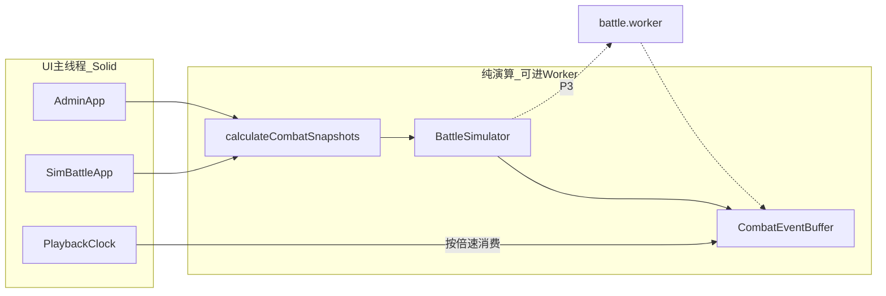

# 三大模块性能优化 · 完整实现计划

> 日期：2026-07-28  
> 状态：部分实现  
> 目标：优化制作物品 / 模拟战斗 / 战斗引擎的页面流畅度与战斗运算速度及机制  
> 终选：**E1 → E2 + S1/A1（Solid）**；**不做 P0**（不在旧 `_runBattleCore` 上热修倍速+Max）  
> 同步：`design/05-战斗系统.md`（演算/播放分离、Playback 倍速、无头 `runToEnd`）  
> 进度：P1 引擎拆分 + Playback 倍速已落地；P3 Worker（max）已落地；P2 Solid 热路径（Admin 列表 / 战斗日志）已接入；拖拽分区刷新已接入  
> 后续已落地：预览/播放控制统一，见 [2026-07-28-统一战斗预览与播放控制.md](./2026-07-28-统一战斗预览与播放控制.md)

---

## 一、定位与 Context

### 现状问题

| 模块 | 主要瓶颈 |
|------|----------|
| 战斗引擎 [`engine.ts`](../project/client/src/game/engine.ts) `_runBattleCore` | 每 tick `await delay(100)` 墙钟 1:1；无倍速；每 tick 重建 `allWeapons`；演算与 UI `onEvent` 同步耦合；`GameEngine` 上帝类 |
| 模拟战斗 [`sim-battle.ts`](../project/client/src/ui/sim-battle.ts) | 拖拽后常全量 `renderZones`；事件反复重绑；战斗 patch 每帧 `querySelectorAll`；日志无上限 |
| 制作物品 [`admin.ts`](../project/client/src/ui/admin.ts) | 任意操作 `render()` = 分类+列表+表单三联 `innerHTML`；搜索无防抖 |

技术栈现状：客户端 **零依赖** Vanilla TS + Vite 6。终选将引入 **SolidJS 1.x** + **Vite module Worker**（E2）。

### 终选结论

| 项 | 选用 | 说明 |
|----|------|------|
| 引擎 | **E1 → E2** | 先抽同步 `BattleSimulator` + Playback；再上 Web Worker |
| 模拟 UI | **S1 Solid** | 细粒度 Signal，重写 sim-battle 热路径 |
| 制作物品 | **A1 Solid** | 与模拟页同技术，共享组件 |
| P0 热修 | **不做** | 不在旧循环上加 `delay(TICK/speed)` / Max 批步进补丁；倍速作为 E1 Playback 正式能力在 P1 落地 |

### 不改变 / 不介入

- 不把战斗权威迁到服务端
- 不上 WASM / SharedArrayBuffer / OffscreenCanvas
- 不引入 React/Vue
- 不借优化改数值平衡公式（除非发现 bug）
- 不改 Admin/Save REST 契约（除非为 Worker 传参所必需的纯客户端结构调整）

---

## 二、核心抽象与规则



### 规则约定

1. **逻辑 tick 仍为 100ms**（与 `design/05-战斗系统.md` 一致）；演算结果与墙钟无关。
2. **演算 / 播放分离**：`BattleSimulator` 同步 `step()` / `runToEnd()`；`Playback` 按 `speed` 向 UI 推送事件与快照。
3. **倍速只影响 Playback**，不影响逻辑步与胜负；同 BD + 同 seed → 事件序列一致。
4. **无头模式**：`runToEnd()` 连续步进至结束，可只展示结果或再回放。
5. **E2**：热循环进 Worker；主线程只跑 Solid UI + Playback 消费。

---

## 三、数据协议

```typescript
// project/client/src/game/battle/types.ts（从 engine 迁出并对齐）

export interface CombatUnitRuntime { /* 现 engine 定义，含 weapons[] */ }
export interface CombatEvent {
  time: number;
  actorName: string;
  weaponName: string;
  targetName: string;
  damage: number;
  targetHpAfter: number;
  targetMaxHp: number;
  effects: string[];
  targetingLabel?: string;
}

export interface BattleInitPayload {
  playerUnits: CombatUnitRuntime[];
  enemyUnits: CombatUnitRuntime[];
  playerOnHitEffects: Array<[string, OnHitEffect[]]>; // Map 可序列化形态（Worker 用）
  enemyOnHitEffects: Array<[string, OnHitEffect[]]>;
  seed?: number;
}

export type PlaybackSpeed = 1 | 2 | 4 | 'max';

// Worker 消息（P3）
// Main→Worker: { type: 'init', payload } | { type: 'runToEnd' } | { type: 'cancel' }
// Worker→Main: { type: 'batch', events: CombatEvent[], snapshot?: ... } | { type: 'done', win: boolean }
```

对齐债务：[`project/shared/types.ts`](../project/shared/types.ts) 中过时的多伤种 `CombatEvent` 在本计划中**改为与引擎一致**或标注 deprecated，避免双源。

---

## 四、涉及文件与改动

| # | 文件 | 改动 |
|---|------|------|
| 1 | `project/client/src/game/battle/types.ts` | 新建：Snapshot/Runtime/Event/协议 |
| 2 | `project/client/src/game/battle/simulator.ts` | 新建：同步 tick 核心（迁自 `_runBattleCore`） |
| 3 | `project/client/src/game/battle/playback.ts` | 新建：倍速/暂停/批事件消费 |
| 4 | `project/client/src/game/battle/targeting.ts` | 新建：selectTarget / sort / filter 纯函数 |
| 5 | `project/client/src/game/battle/onhit.ts` | 新建：onHit 结算 |
| 6 | `project/client/src/game/battle/battle.worker.ts` | 新建（P3）：Worker 入口 |
| 7 | `project/client/src/game/engine.ts` | 瘦身：保留快照/部署/存档；战斗委托 Simulator/Playback |
| 8 | `project/client/src/ui/sim-battle/` | Solid 重写（拆 App/Pool/Deploy/BattleHud/Log） |
| 9 | `project/client/src/ui/admin/` | Solid 重写（List/Form/Filters 分区） |
| 10 | `project/client/src/ui/panels.ts` | 正式战斗接 Playback API |
| 11 | `project/client/src/ui/pointerDrag.ts` | 保留；Solid `onCleanup` 适配 |
| 12 | `project/client/package.json` | 加 `solid-js`、`vite-plugin-solid`；建议加 `vitest` |
| 13 | `project/client/vite.config.ts` | `vite-plugin-solid`；Worker 支持 |
| 14 | `project/shared/types.ts` | 对齐 CombatEvent / 快照字段 |
| 15 | `design/05-战斗系统.md` | 增补演算/播放分离、Playback 倍速、无头模式 |
| 16 | `project/client/src/game/battle/simulator.test.ts` | 确定性回归 + `runToEnd` 耗时探针 |

---

## 五、实施顺序

| 阶段 | 内容 | 验收焦点 |
|------|------|----------|
| **P1 引擎 E1** | 抽出 Simulator/Playback/targeting/onhit；`runCombat`/`runSimCombat` 薄封装；UI 暂用现有 DOM 接 Playback（可先最小改动接倍速控件） | 无头 &lt;50ms；同 BD 事件序列一致；暂停/取消仍可用 |
| **P2 UI S1+A1** | 引入 Solid；重写 sim-battle + admin；共享 Filter/VirtualList/卡片信息组件 | 拖卡/筛选主线程 &lt;16ms；无全页三联重绘；战斗数值 signal 更新 |
| **P3 引擎 E2** | `battle.worker.ts`；主线程只 Playback；取消/错误通道 | 演算中拖动/输入仍流畅；结果与 P1 一致 |
| **P4 验收加固** | 黄金样例 hash；performance mark；修 `shared/types` 双源 | 清单全绿 |

**明确取消：P0**（不在旧 `_runBattleCore` 上打倍速/Max 补丁）。

### P1 实现要点（其它智能体可直接施工）

1. 将 `_runBattleCore` 逻辑改为同步循环：去掉内部 `await delay`；由 `Playback` 决定何时 `step` 或先 `runToEnd` 再回放。
2. `allWeapons` 提到循环外或 death-dirty 重建。
3. `onEvent` 改为写入 buffer；Playback 按帧 `flush` 一批给 UI。
4. `panels.ts` / 现有 `sim-battle.ts` 在 P1 末期改为调用 Playback（P2 再 Solid 化亦可：若 P1/P2 并行困难，**先完成 P1 纯引擎 + 最小 UI 接线，再 P2 全量 Solid**）。

### P2 实现要点

1. `vite.config.ts` 启用 `vite-plugin-solid`；仅 `.tsx` 走 Solid（或统一 sim/admin 为 tsx）。
2. 模拟页：`PoolPanel` / `DeployBoard` / `BattleHud` / `BattleLog`；拖拽后**只更新受影响侧** signal。
3. Admin：`renderList`/`renderForm`/`renderCatFilter` 独立 store 切片；搜索防抖；离开页清理 `document` 监听。
4. 日志：批插入 + 保留上限（如 500）或虚拟列表。

### P3 实现要点

1. Vite：`new Worker(new URL('./battle.worker.ts', import.meta.url), { type: 'module' })`。
2. `OnHitEffect` Map → 可结构化克隆的数组对；禁止在 Worker 消息里传函数。
3. 主线程 fallback：Worker 不可用时回退 P1 主线程 Simulator（同 API）。

---

## 六、验证方式

### 引擎

1. [ ] 同 `DeploySlot[]` 黄金样例：`runToEnd()` 两次事件序列 JSON hash 相同
2. [ ] 无头单场（满 120s 逻辑或提前结束）Chrome/Node：**&lt; 50ms**
3. [ ] 超时软狂暴、onHit、友方/条件 targeting、超重耐力与改造前行为一致（对照样例）
4. [ ] `runCombat` / `runSimCombat` 胜负与奖励/无奖励语义不变
5. [ ] 暂停 / 取消在 Playback 与 Worker 路径均生效

### 模拟战斗 UI

1. [ ] 筛选、搜索、拖入/排序卡槽：交互无明显掉帧（目标任务 &lt; 16ms）
2. [ ] 拖拽提交后**不**无故重建未改动侧整树（Solid 下仅脏信号更新）
3. [ ] 战斗中 HP/耐力/CD 连续更新；日志不导致长战斗明显卡顿
4. [ ] Playback 支持 1x/2x/4x/max；max 下可近即时看完（演算已完成或并行）

### 制作物品 UI

1. [ ] 搜索防抖；勾选/选中不重建整个表单无关区
2. [ ] 大表单编辑流畅；Popover 打开不触发整页 `render`
3. [ ] 导入/导出/分类管理行为与现网一致
4. [ ] 离开页面无残留 `document` 级监听

### Worker（P3）

1. [ ] 与主线程 Simulator 同 BD 结果一致
2. [ ] Worker 失败自动 fallback，用户可感知或不中断战斗

---

## 七、影响分析

- **向后兼容**：存档 JSON、Admin API、对战池 upload BD 保持；客户端内部战斗 API 签名可变为 Playback 包装，调用方 `panels`/`sim-battle` 同步改。
- **明确不做**：P0 热修；WASM；服务端权威战斗；改平衡数值；React/Vue。
- **扩展预留**：`BattleSimulator` 可供未来配平脚本/批量跑分；Worker 协议可加 `stepN`。
- **design 同步**：实现 P1 前或同时更新 `design/05-战斗系统.md` §2 时间线，增加「演算与播放」「Playback 倍速」「无头 runToEnd」小节；逻辑 100ms tick 不变。

---

## 八、备选方案索引（未采用，供回溯）

| 代号 | 内容 | 未采用原因 |
|------|------|------------|
| E0/P0 | 旧循环加 delay/speed/Max | 用户明确不做；与 E1 重构重复且难 Worker |
| E3 WASM | 热循环进 WASM | 规模小 ROI 差 |
| S0/A0 Vanilla 增量 | 零依赖打磨 | 终选要 Solid 长期收益 |
| S2 Lit / S3 Preact | 其它 UI 栈 | 终选 Solid 性能与包体更优 |

完整维度对比见对话期计划原稿；本文件以终选施工为准。
