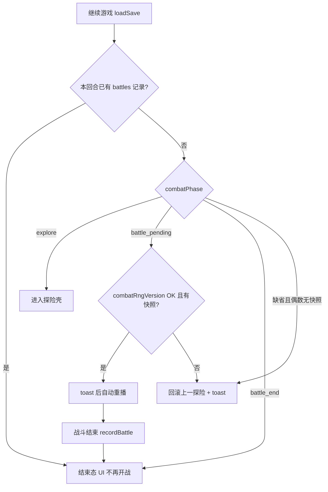

# 存档机制优化

> 日期：2026-08-14  
> 状态：已实现  
> 修订：2026-08-17 补实现约定  
> 范围：核心对齐设计 + 体验增强；一次实现全部修改点后验收  
> 与 `design/01-游戏概述.md`、`design/02-名词解释.md` 同步（短节增补）

## 目标

让进行中存档达到设计承诺的续玩能力（开战快照重播、结束态还原），并让探险进度在提交型操作后可靠落盘到服务端；不引入战斗中断点续打、本地离线档或多槽位。

## 拷问决议汇总（已冻结）

| # | 议题 | 决议 |
|---|------|------|
| 1 | 探险即时存粒度 | **B** 仅提交型操作（非 notify 全量、无 debounce） |
| 2 | 手动存档 | **A** 保留 |
| 3 | `battle_pending` 读档 | **C** toast 后自动重播 |
| 4 | 探险自动存失败 | **A** 继续玩 + toast + 可手动重试 |
| 5 | 关键节点存档失败 | **A** 阻断推进 |
| 6 | 返回主菜单 | **直接 flush 后回**；失败只 toast，无确认 |
| 7 | 新游戏覆盖 | **A** 有存档时确认后覆盖 |
| — | 战斗进行中存档 | 不存；开战+结束态；崩溃重播 |
| 8 | 多标签/多端 | **A** last-write-wins；不做版本冲突 |
| 9 | 历史 in_progress 孤儿 | **A** 本次不治理 |
| 10 | 全文战斗日志 | **A** 进行中档保留 `battles[].log` |
| 11 | 局内 JWT 过期 | **A** 弹登录，成功后 flush 当前内存 |
| 12 | Worker | **A** 正式局强制主线程 + seededRandom |
| 13 | 自动存成功反馈 | **A** 成功静默；失败才 toast |
| 14 | 存档体积上限 | **B** `MAX_SAVE_SIZE` → 2MB |
| 15 | 旧档偶数回合无快照 | **A** 回滚上一探险 + toast |
| 16 | DB_PATH | **A** 相对服务端目录绝对化 + 启动打日志 |
| 17 | beforeunload / Beacon | **C** 本次不做 |
| 18 | 结束态 history 失败 | **A** 档成功可停结束态；继续前再试 sync |
| 19 | combatRngVersion | **A** 写入；不匹配则回滚探险 |
| 20 | 删除存档确认 | **A** 保持确认框 |
| 21 | Admin 重置 | **A** 不得动 saves/users/history |
| 22 | 测试深度 | **A** 核心客户端单测 + 手工验收 |
| 23 | 交付节奏 | **A** 一次做完再验收 |
| 24 | design 粒度 | **A** 01/02 短节增补 |

---

## 实现约定（防猜错，2026-08-17）

其它智能体必须按下列约定实现，不得自行发明等价方案。

### A. 提交型存挂点（对应拷问 #1 B）

禁止在通用 `notify()` 末尾无条件 `requestSave`。整理 BD 时 `moveDeploySlot` 等会连续 `notify`，会变成拖拽中间帧刷写。

采用组合：

1. 探险写路径的提交出口显式 `requestSave({ reason: 'explore-commit' })`：购售成功、选事件、刷新商店、工匠确认、仓库/BD 放置完成。
2. 拖拽期间 `engine.suppressExploreSave = true`（或等价标志）；`pointerup` / drop 成功后再清标志并 `requestSave`。
3. 核对漏挂点：`project/client/src/ui/officialExplore.ts`、拖拽相关模块里单独调用 `notify()` 的路径。

### B. 正式局禁止 Worker（对应拷问 #12 A）

`project/client/src/game/battle/workerHost.ts` 的 `runBattleWithOptionalWorker` 在 `speed === 'max'` 时走 Worker。正式局（含读档重播）即使 Max 也必须主线程，并注入 `seededRandom(combatSeed)`。做法：加 `forceMainThread`，或正式局不走该 Worker 分支。否则同 seed 结果会对不上。模拟战可继续用 Worker。

### C. DB 根目录查找（对应拷问 #16 A）

`tsconfig` `rootDir` 为 `..`，tsx 跑 `src/` 与编译后 `dist/server/src/` 差两层。禁止写死 `__dirname/../data/game.db`。

约定：从当前模块文件向上查找含 `data/seed` 的 `project/server` 根，再拼 `data/game.db`。`process.env.DB_PATH`：相对路径相对该根，绝对路径原样。种子目录同一基准。启动日志打印 resolve 后的绝对路径。

### D. Toast / 401 通道（对应拷问 #4 / #11）

engine 不直接弹 UI。注入 `onSaveError`、`onAuthExpired`，由 `UIManager` / `main.ts` 处理。

`flushSave` 因 401 失败：toast「登录已过期」→ 登录模态（不销毁 `GameEngine`/`UIManager`）→ 成功后再 flush。不要把 401 当成开战网络失败去 `rollbackBattleToExplore`。

### E. 重播幂等（读档核心）

`runCombatWithSides` / `settleOfficialAutoWin` 有副作用：获胜再加备用池金币、`recordBattle` 再推一条。读档不能「见到偶数回合就开打」。

| 判定 | 含义 | 读档行为 | 禁止 |
|------|------|----------|------|
| `battle_pending`，rng 版本匹配，且本回合尚无 `battles` 记录 | 已匹配未打完 | toast 后用快照重播；打完才 `recordBattle`/发奖 | 再抽对战池 |
| `battle_end`，或偶数回合已有 `round === 当前回合` 的 `battles` 记录 | 已结算 | 只还原结束态 UI（摘要、「继续」、日志） | 再跑 Simulator / `settleOfficialAutoWin` / `recordBattle` |
| 偶数回合、无本回合战报、无合法快照或 rng 版本不匹配 | 残缺旧档 | 回滚 `round-1` 探险 + toast（拷问 #15） | 强行重播 |

`resumeFromSave` 先看 `combatPhase`，再用「本回合是否已有 `battles` 记录」校正。空池自动胜同理：已有本回合 `auto_win` 则不要再调 `settleOfficialAutoWin`。

结束态敌方 BD：不要依赖 `onEnd` 清空后的内存 `pendingEnemySlots`。来源：存档 `pendingEnemyBd`（开战写入后带到 `battle_end`），或 `battles` 本回合最后一条的 `enemyBd`。写档顺序：`onEnd` 先把 `battle_end` + 快照/`battles` 写入再清内存。

---

## 修改点 1：战斗阶段快照与读档恢复

### 现状

- `project/client/src/game/engine.ts` 的 `toSaveData()` 不含开战快照；`combatSeed` 未赋值；正式战 RNG 未注入。
- `project/client/src/ui/panels.ts` 的 `pendingEnemySlots` / `combatFinished` 仅内存。
- 偶数回合读档易卡在无「继续」、无法重播的战斗壳。

### 期望

- 存档字段：`combatPhase: explore | battle_pending | battle_end`，`pendingEnemyBd`、`pendingAutoWin`、`combatSeed`、`combatResultSummary`、`combatRngVersion: 1`；全文日志在 `battles[].log`；`saveVersion: 4`。
- 匹配成功 → 写 `battle_pending` 再开打；结束 → `battle_end`；点继续 → 清战斗字段回 `explore`。
- 读档按「实现约定 E」幂等分支。
- 正式局按「实现约定 B」主线程 + seed。

### 原因

对齐 `design/01` 开战快照 / 结束态还原 / 同 seed 重播；避免假重播、重复发奖、卡死。

### 实现

- `project/client/src/game/engine.ts`：扩展序列化/反序列化；生成并持久化 `combatSeed`/`combatRngVersion`；战斗路径注入 RNG；`getCombatResume` / 清战斗字段；旧档迁移；本回合是否已有 `battles` 记录的判定。
- `project/client/src/game/battle/workerHost.ts` 或正式局调用处：`forceMainThread`（见约定 B）。
- `project/client/src/ui/panels.ts`：`startCombat` 匹配成功后写入快照再 `flushSave`；`onEnd` 先写 `battle_end` 再清 `pendingEnemySlots`；`resumeFromSave()`。
- `project/client/src/main.ts`：读档成功后 `ui.resumeFromSave()`。
- 单测：phase round-trip；同 seed 关键结果一致；`battle_end` 读档不调用 `recordBattle` / `applyCombatVictoryRewards`。

---

## 修改点 2：写入串行化与关键路径可靠落盘

### 现状

- 多处 `void autoSave()`、无队列、失败仅 `console.warn`；新游戏未 await。
- 继续游戏 load 失败会静默 `resetState`。

### 期望

- `requestSave` / `flushSave`：串行 PUT + dirty coalesce（最多 1 inflight，结束后若 dirty 再写最新 `toSaveData()`）。
- 关键节点（新游戏、开战、结束态存档、通关、手动存）await flush；失败阻断推进。
- 结束态：存档成功但 `syncHistoryRun` 失败 → 仍显示结束态并 toast；点「继续」再试 history，成功才推进。
- 新游戏：有进行中档则确认「将覆盖未通关进度，历史保留」后再覆盖写。
- 继续游戏 load 失败：toast，留在开始页，禁止静默开新局。
- Toast/401 见「实现约定 D」。

### 原因

防止并发覆盖丢进度；关键相位必须以服务端档为准；history 为旁路。

### 实现

- `project/client/src/game/engine.ts`：`saveInFlight` / `saveDirty` / `requestSave` / `flushSave`；`onSaveError` / `onAuthExpired`。
- `project/client/src/main.ts`、`project/client/src/ui/panels.ts`：关键路径 await；结束态分拆 save vs history；新游戏确认。
- 单测：队列 coalesce（最终等于最后状态）。

---

## 修改点 3：探险提交型即时存

### 现状

探险中途变更几乎只靠手动存。

### 期望

- 仅探险且 `combatPhase===explore` 时，提交型操作完成后立刻 `requestSave`（见约定 A）。
- 成功静默；失败 toast（连续失败只首次）并允许继续玩；手动存保留，成功可提示「已存档」。
- 返回主菜单：尽力 flush 后直接回开始页；失败仅 toast，无确认框。

### 原因

「即时存」= 有意义操作结果立刻入队，而非每帧；回主菜单要零额外点击。

### 实现

- 见「实现约定 A」。
- `project/client/src/ui/panels.ts` 返回主菜单：去掉「可能丢进度」确认，改为 flush → navigate。

---

## 修改点 4：Token 校验解耦与局内 401

### 现状

启动用 `saves.list()` 验登录；任意错误清 token。

### 期望

- `GET /api/auth/me`；启动仅用 me；仅 401 清 token；网络/5xx 提示重试并保留 token。
- 局内 API 401：见「实现约定 D」。

### 原因

存档故障 ≠ 未登录；即时存下更易碰到过期。

### 实现

- `project/server/src/routes/auth.ts`：`GET /me` + `authMiddleware`。
- `project/client/src/api/client.ts`：`auth.me`；401 钩子。
- `project/client/src/main.ts`：启动改 me；局内登录成功回调 flush。

---

## 修改点 5：通关删档补偿

### 现状

`syncHistoryRun('cleared')` 成功后 `saves.del()` 失败 → 仍可「继续游戏」进已通关局。

### 期望

- cleared 成功、del 失败：文案 + 重试删除；回主菜单前再试 del。
- cleared 失败：不删档。

### 原因

避免已通关局残留进行中档。

### 实现

- `project/client/src/ui/panels.ts` `renderSettlement` 拆步与重试 UI。

---

## 修改点 6：服务端路径与存档上限

### 现状

- `DB_PATH` 默认 `./data/game.db` 相对 cwd，换启动目录会连到另一份空库。
- 种子目录绑 `process.cwd()`。
- `MAX_SAVE_SIZE = 500_000`。

### 期望

- 库与种子目录解析见「实现约定 C」。
- `MAX_SAVE_SIZE = 2_000_000`（对齐 Express 2mb body）。

### 原因

防「账号/存档消失」假故障；放宽护栏匹配全文日志策略。tsx 与 `tsc` 输出目录不同，不能写死相对 `__dirname` 的固定层数。

### 实现

- `project/server/src/config.ts`、`project/server/src/db/connection.ts`、`project/server/src/db/seedData.ts`、`project/server/src/db/repositories/saveRepo.ts`。

---

## 修改点 7：设计文档短节增补

### 现状

design 已有存档节点，缺 combatPhase / 提交型存 / 阻断策略等实现约定。

### 期望

在 `design/01`、`design/02` 存档相关处短节增补（不整节重写）：三态、提交型即时存、关键节点阻断、战斗中不存、新游戏确认。

### 原因

项目约定机制变更同步 design。

### 实现

- 编辑 `design/01-游戏概述.md`、`design/02-名词解释.md` 对应小节。

---

## 读档状态机

---

## 明确不做

- 战斗进行中周期性存档 / HP 断点续打
- localStorage 离线存档 fallback、多存档槽位
- 服务端乐观锁 / 多端冲突检测
- 历史 in_progress 孤儿治理、abandoned 状态
- 超限自动剥旧 log
- beforeunload / sendBeacon 补存
- Admin「一键清空玩家进度」危险按钮
- E2E / 服务端测试全家桶；拆批合并

## 已知限制

- 无快照的旧档回滚探险时，可能丢掉「开战时已结算的事件」（仅旧档；新档有 `combatPhase` 后不走此路径）。
- 存档超过 2MB 仍失败（已决定不剥 log）；关键节点失败则阻断推进。

## 实施顺序（一次交付）

1. 修改点 6（路径 + 上限）— 先稳住库文件
2. 修改点 2（写队列）— 底座
3. 修改点 1（combatPhase + 幂等读档）
4. 修改点 3（提交型存）
5. 修改点 4（me + 401）
6. 修改点 5（通关补偿）
7. 修改点 7（design）+ 单测 + 手工验收

## 验收清单

1. [ ] 提交型操作后存档；拖拽过程不刷写
2. [ ] 匹配后杀进程 → 继续游戏 toast 后重播同对手
3. [ ] 结束态杀进程 → 继续游戏仍结束态，金币与 `battles` 条数不翻倍
4. [ ] 同 combatSeed 单测结果一致；正式局 Max 不走 Worker
5. [ ] 队列 coalesce 单测通过
6. [ ] 后端未起时启动不因 saves 清 token
7. [ ] 通关 del 失败可重试；成功后继续游戏禁用
8. [ ] 新游戏有档时确认；取消不改档
9. [ ] 回主菜单无确认框；失败仅 toast 仍回
10. [ ] 不同 cwd 启动仍同一 `server/data/game.db`（日志有绝对路径）；tsx 与 `node dist` 指向同一文件
11. [ ] 结束态 history 失败可看结束态；继续前重试 sync
12. [ ] Admin 清模板不删 saves/users/history
13. [ ] design/01、02 已短节增补
14. [ ] 局内 401：弹登录后引擎仍在，flush 成功；不开战回滚探险

## 相关设计文档

- `design/01-游戏概述.md`（存档与历史归档）
- `design/02-名词解释.md`（存档与历史）
- `design/05-战斗系统.md`（开战快照 / combatSeed）
- `doc/2026-07-29-正式游戏与存档设计修订.md`（决策来源）
